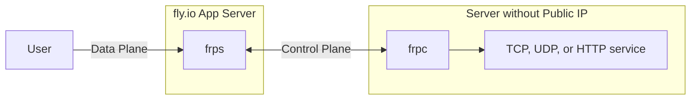

# frp & tailscale exit on fly.io
[Fast reverse proxy](https://github.com/fatedier/frp) on [fly.io](https://fly.io)

Run your own frp tunnel for free (within free tier) on fly.io

Now you can have ngrok TCP/UDP tunnel with the ports you want, not randomly generated ports on ngrok unless you [pay for the pro monthly](https://ngrok.com/pricing).



## fly.io Deployment
You need [flyctl](https://github.com/superfly/flyctl)

1. Clone this repository.
2. Check if frp version in Dockerfile is latest, if not, change to the latest version.
3. Create an app on fly.io `fly launch --copy-config --name app-name --no-deploy`.
4. Select the region closest to you.
5. Set environment variables. `fly secrets set -a app-name FRP_TOKEN=12345678 FRP_DASH_USER=admin FRP_DASH_PWD=admin`
6. Deploy to fly.io `fly deploy -a app-name --remote-only`.
7. Try to connect to frps using `server_addr = app-name.fly.dev`, `server_port = 7000`, `protocol = kcp`, and `token = 12345678` in frpc.ini.

Don't forget to change the token so that others can't use your frp tunnel.

You can also view https://app-name.fly.dev in browser to view the frps dashboard.

## Change server configuration
Type `fly deploy -a app-name --remote-only` on the repository after editing frps.ini

## Switch
fly.io runs app 24/7, if you are not using your tunnel for a while, it is recommended to suspend it to conserve free tier and resources.

* Suspend frp `fly scale count 0 -a app-name`
* Resume frp `fly scale count 1 -a app-name`

## TCP or UDP tunnel, not both
Since in fly.io, it is [required to bind to `fly-global-services`](https://fly.io/docs/app-guides/udp-and-tcp/#the-fly-global-services-address) in order for UDP to work, but frp `proxy_bind_addr` only allow to bind in one address, so we need to disable TCP if you want to use UDP as TCP does not work on `fly-global-services`.

You need to have a separate frp instance if you need to tunnel both TCP and UDP. One for TCP using `proxy_bind_addr = 0.0.0.0` and one for UDP using `proxy_bind_addr = fly-global-services`.

## KCP Protocol
[KCP](https://github.com/skywind3000/kcp/blob/master/README.en.md) (a protocol built on UDP) is used by default ~~so that a TCP meltdown (TCP over TCP tunnel) will not happen~~ and to reduce latency (like for game servers).

You can also use TCP if KCP is not working for you. Check the [wiki](https://github.com/AnimMouse/frp-flyapp/wiki/Use-TCP-in-control-plane) for tutorial.

## XTCP P2P
You can use this frp tunnel like a STUN server. `bind_addr` should be set in `fly-global-services` in order for XTCP to work. This feature is enabled by default.

## Example frpc.ini
```ini
[common]
server_addr = app-name.fly.dev
server_port = 7000
protocol = kcp
token = 12345678

# TCP tunnel, requires proxy_bind_addr = 0.0.0.0 in frps.ini
[minecraft-java]
type = tcp
local_ip = 127.0.0.1
local_port = 25565
remote_port = 25565

# UDP tunnel, requires proxy_bind_addr = fly-global-services in frps.ini
[minecraft-bedrock]
type = udp
local_ip = 127.0.0.1
local_port = 19132
remote_port = 19132
```

### fly.io free tier
fly.io requires a credit card in order to work, if you don't have a credit card or if you are afraid that fly.io will charge you so much, it is recommend to buy prepaid credits that can be used with virtual credit cards.

### HTTP Tunneling
If you are tunneling HTTP apps instead of TCP/UDP, I recommend to just use [Cloudflare Tunnel](https://www.cloudflare.com/products/tunnel/).\
You can also tunnel HTTP apps on this frp by using a custom port like 8080.\
If you need to use standard 80 and 443 port, you need to disable the frps dashboard. Check the [wiki](https://github.com/AnimMouse/frp-flyapp/wiki/HTTP-Tunneling) for tutorial.

### IPv6 Support
If you have IPv6, congratulations, [you don't need this tunnel](https://www.reddit.com/r/networkingmemes/comments/sif407/imagine_network_engineers_time_gone_into/).

To enable IPv6 in control plane, set `bind_addr = ::` in frps.ini. Take note that KCP does not work in IPv6 as [`fly-global-services` does not support IPv6] so you would need to use TCP if you use IPv6 in control plane.

To enable IPv6 in data plane, set `proxy_bind_addr = ::` in frps.ini and `local_ip = ::1` in frpc.ini. Take note that UDP does not work in IPv6 as [`fly-global-services` does not support IPv6] so you can't tunnel UDP in IPv6.

[`fly-global-services` does not support IPv6]: https://fly.io/docs/app-guides/udp-and-tcp/#udp-won-t-work-over-ipv6

### More infos
* [anderspitman/awesome-tunneling](https://github.com/anderspitman/awesome-tunneling)

# 🖕 Carrier-grade Network Address Translation (CGNAT)
* [Is NAT a conspiracy?](https://chatgptwith.me/posts/is-nat-a-conspiracy/)


------------------


This repo shows how to run tailscale on fly, specifically to run exit nodes.
If you want to add tailscale to a fly.io application, follow this guide instead: https://tailscale.com/kb/1132/flydotio/

Did you ever need a wormhole to another place in the internet? But you didn't trust the shady VPN providers with ads all over YouTube?
Well, why not run it "yourself"? This guide helps you to set up a globally distributed and easily sharable VPN service for you and your friends.
- Instantly scale up or down nodes around the planet
- Choose where your traffic exits to the internet from [30+ locations](https://fly.io/docs/reference/regions/).
- Enjoy solid connections worldwide
- Bonus: the setup and the first 160GB of traffic each month are gratis. _Update_: a dedicated IPv4 to enable P2P communication (not via DERP) now [costs $2/mo](https://fly.io/docs/about/pricing/#anycast-ip-addresses)

Sounds too good to be true. Well that's probably because it is. I compiled this setup as an excercise while exploring the capabilities of fly.io and tailscale. This is probably not what you should use as a serious VPN replacement. Go to one of the few trustworthy providers. For the reasons why this is a bad idea, read [below](#user-content-why-this-probably-is-a-bad-idea).

Checkout gbraad's fork if you want to include squid, dante and gitpod https://github.com/spotsnel/tailscale-tailwings 


<details>
<summary>Video of tailscale on iOS changing exit nodes.</summary>
<br>
https://user-images.githubusercontent.com/3500621/129452512-616e7642-5a03-4037-9dc1-f6be96ca1e30.mp4
</details>


## Setup

#### 1. Have a GitHub account
Create a GitHub account if you don't have one already: https://github.com/signup

#### 2. Have a GitHub organization
Let's create a new github org for your network: https://github.com/organizations/plan
- Choose a name for your network: eg. `banana-bender-net`
- Plan: free

#### 3. Have tailscale
Install tailscale on your machine(s):
- Instal it on your notebook and mobile phone: https://tailscale.com/download
- Login with github, choose the github organization created before (eg. `banana-bender-net`).
- Check your network and keep this tab around: https://login.tailscale.com/admin/machines

#### 4. Setup DNS in tailscale
In order to use tailscale for exit traffic you need to configure a public DNS. Go to https://login.tailscale.com/admin/dns and add the nameservers of your choice (eg. cloudflare: `1.1.1.1, 1.0.0.1, 2606:4700:4700::1111, 2606:4700:4700::1001`)

#### 5. Create a tailscale auth key
Create a reusable auth key in tailscale: https://login.tailscale.com/admin/settings/authkeys

_A ephemeral key would be better for our use case, but it's restricted to IPv6 only by tailscale, which doesn't work so well as a VPN exit node._


#### 6. Have a fly.io account and cli
Install the fly-cli to your machine and login with github: https://fly.io/docs/hands-on/installing/

#### 7. Have a fly.io organization
- Create an org on fly (technically there is no requirement to name it the same).
`flyctl orgs create banana-bender-net`
- Go and enter your credit card at [https://fly.io/organizations/banana-bender-net](https://fly.io/organizations). It's only going to be charged if you use more than the [free resources](https://fly.io/docs/about/pricing/).

#### 8. Setup fly
Give the app the name you want. Don't deploy yet.
```
git clone https://github.com/patte/fly-tailscale-exit.git

cd fly-tailscale-exit

flyctl launch

? fly.toml file already exits would you like copy its configuration : (yes/no) yes

? App Name (leave blank to use an auto-generated name) tailwings

? Select organization: banana-bender-net-test (banana-bender-net-test)

? would you like to deploy postgressql for the app: (yes/no) no

? would you like to deploy now : (yes/no) no
```

#### 9. Set the tailscale auth key in fly
```
flyctl secrets set TAILSCALE_AUTH_KEY=[see step 4]
Secrets are staged for the first deployment
```

#### 10 Deploy (and IP and scale)

```
flyctl deploy
? Would you like to allocate a dedicated ipv4 address now? Yes
```
_Update_: fly.io does [not automatically allocate a dedicated IPv4 per app on the first deployment anymore](https://community.fly.io/t/announcement-shared-anycast-ipv4/9384). You want a dedicated IPv4 to be able to expose the UDP port on it and thus enable peer-to-peer connections (not via tailscale DERP). You have three options:
- Say yes during the initial deploy.
- Run the command `flyctl ips allocate-v4` to add a dedicated IPv4 later
- Run `flyctl ips allocate-v6`. Direct connections to the node will only work if your local machine has a global IPv6. (not tested) 
- Remove the `services.ports` section from fly.toml. This has the disadvantage that your node is never going to be directly reachable and all your traffic is routed via tailscale DERP servers.

At the time of writing fly deploys two machines per default. For this setup you probably want 1 machine per region. Run the following to remove the second machine:
```
flyctl scale count 1
```

#### 11. Enable exit node in tailscale
Wait for the node to appear in the tailscale machine overview.
Enable exit routing for the nodes https://login.tailscale.com/admin/machines (see [tailscale docs](https://tailscale.com/kb/1103/exit-nodes/#step-2-allow-the-exit-node-from-the-admin-panel) on how to do it)


#### 12. Connect with your local machine or smartphone
On iOS, choose "use exit node" and there you go.

On linux, just run
```
tailscale up --use-exit-node=fly-fra
```

#### 13. Regions
To add or remove regions just type:
```
flyctl scale count 1 --region hkg
flyctl scale count 1 --region fra

or:
flyctl scale count 3 --region hkg,fra,ams

or remove a machine explicitly:
fly status
fly machine stop $(machine_id)
fly machine destroy $(machine_id)
```
Wait for the node to appear in tailscale, confirm it to be a legit exit node (step 11), choose it in your client boom! In less than 5 minutes you access the internet from another place.<br/>
Note: See the [fly docs about scaling] for further info: https://fly.io/docs/apps/scale-count/ <br/>
Note: Scaling up also reinitializes the existing nodes. Just use the newly created one and delete the old.<br/>
Note: It seems that not all fly ips are correctly geo located or that not all fly regions have their own exit routers and some use another for egress traffic. This needs further investigation. See this [HN discussion](https://news.ycombinator.com/item?id=36064854) about it.

https://user-images.githubusercontent.com/3500621/129452587-7ff90cd2-5e6d-4e39-9a91-548c498636f5.mp4

#### Update
```
git pull
fly deploy --strategy immediate
```
Then manually remove the old nodes in tailscale and enable exit node in tailscale.


Checkout [this fork](https://github.com/StepBroBD/Tailscale-on-Fly.io/tree/stepbrobd-pr-feat-auto-deploy) for an approach to auto deploy to fly with a github action (including managing tailscale nodes with a python script).


#### Halt
In case you want to stop:
```
sudo systemctl stop tailscaled
flyctl suspend
```

#### Remove
In case you want to tear it down:
```
flyctl orgs delete banana-bender-net
```
[Request the deletion](https://tailscale.com/contact/support/?type=tailnetdeletion) of the tailnet.


### Optional: Auto approve exit nodes
To auto approve the fly machines as exit-nodes in tailscale. Add the following ACLs:
```json
{
  "tagOwners": {
    "tag:fly-exit": [
      "YOUR-USERNAME@github", // user creating the tailscale auth key (step 5)
    ],
  },
  "autoApprovers": {
    "exitNode": ["tag:fly-exit"],
  },
}
```
Then uncomment `--advertise-tags=tag:fly-exit` (and `\` on the previous line) in [start.sh](start.sh) and deploy `fly deploy --strategy immediate`.


## Invite your friends
All you need to do to invite friends into your network is to invite them to the github organization, have them install tailscale and login with github. They immediately see the available exit nodes and can use whichever they please.


## Why this probably is a bad idea
- Dirty egress traffic for fly.io.<br>
Usually traffic exiting fly machines is upstream API traffic not dirty users surfing the web. If too many people do this and use it for scraping or worse fly's traffic reputation might suffer.

- Increased traffic on tailscale derp servers.<br>
  Usually tailscale is used for internal networks. If everybody uses this as their everyday VPN the traffic the derp servers might increase beyond what's forseen.

- Tailscale teams is supposed to cost money.<br>
  ~~Tailscale lists teams to [cost $5 per user per month](https://tailscale.com/pricing/) but creating and using a github org in the way described above doesn't count as team but as personal account. I didn't find a way to upgrade an org created this way into a paying org. Please let me pay ;)~~ It seems you can pay at tailscale for a github team now, so go there and do that if you use this together with others: https://login.tailscale.com/admin/settings/billing/plans This makes this VPN approach being fully paid.
> You’ll never be stopped from spinning up more devices or subnet routers, or trying out ACL rules. We encourage you to play around, find what works best for you, and update your payment settings after-the-fact.

[source](https://tailscale.com/blog/2021-06-new-pricing/)
Kudos to tailscale for using soft-limit, IMHO this makes for a great user experience and I'd expect it to simplify some code parts as well.

## Love Letter
Just enjoy the magnificence, the crazyness of the house of cards that the modern cloud is. I seriously enjoyed setting this up with fly and tailscale. I think both are mind blowingly awesome.

I mean tailscale... just look at it. The already awesome wireguard set up to a [mesh](https://tailscale.com/blog/how-tailscale-works/) by an open-source [client](https://github.com/tailscale/tailscale) that does [all sorts of NAT wizardry](https://tailscale.com/blog/how-nat-traversal-works/), provided servers to route through if P2P doesn't work and a nice web-ui. It's just great.
If I could wish for anything it would be to be able to run the server part myself (I know about [headscale](https://github.com/juanfont/headscale) and I'll give it a try next) . Not because I don't want to pay the company money, the contrary is the case, but because I just don't feel comfortable having my (bare-metal) machines trusting a network interface for which I can't fully control who is connected to the other end. Tailscale could auth a machine into my network and I'd have no possibility to reliably find out.


What gets me most about fly is the approach to turn Dockerfiles into microVMs. Imagine docker but with `--privileged --net=host`. This is what makes this example so simple in comparison to [other cloud providers](https://tailscale.com/kb/guides/): Just a neat Dockerfile and start script but you can use tailscale as if it would run on a real linux host, because it does. No need to [run tailscaled with](https://tailscale.com/kb/1107/heroku/) `--tun=userspace-networking --socks5-server=localhost:1055`, the tailscale interface get's added to the VM and everything just works. This includes that the [metrics gathered by fly](https://fly.io/docs/reference/metrics/) automatically include the `tailscale0` interface and you can view it's traffic chart in grafana easily.


This plus anycast, interapp vpn, persistent storage, locations all over the world, an open-source [client](https://github.com/superfly/flyctl) and being a chatty crew with the mindset ["Go Nuts"](https://fly.io/blog/ssh-and-user-mode-ip-wireguard/) have me left in awe.

